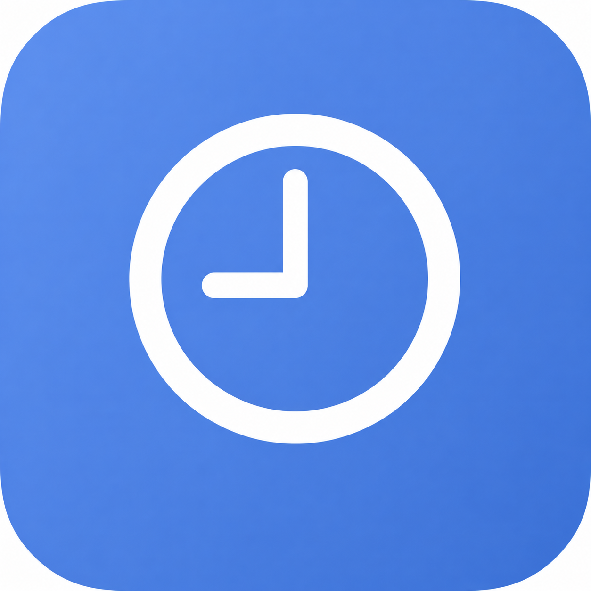
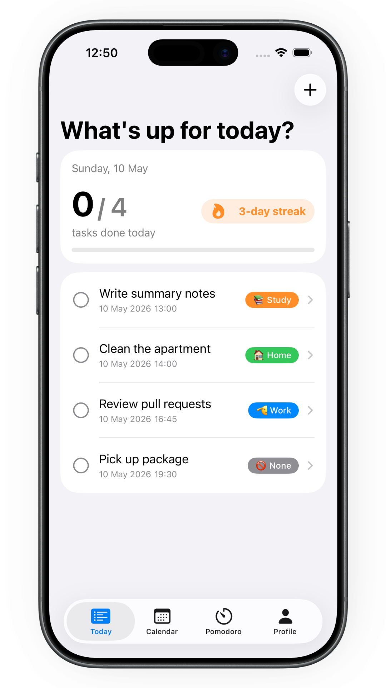
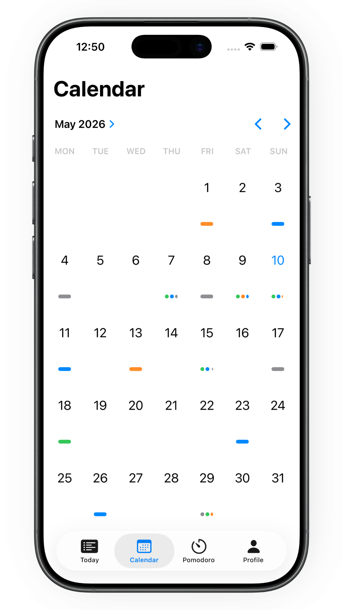
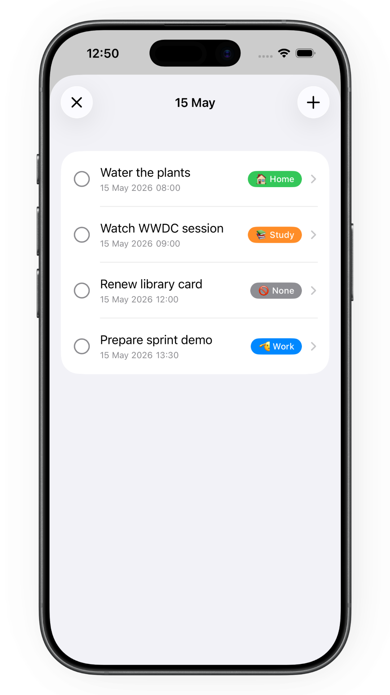
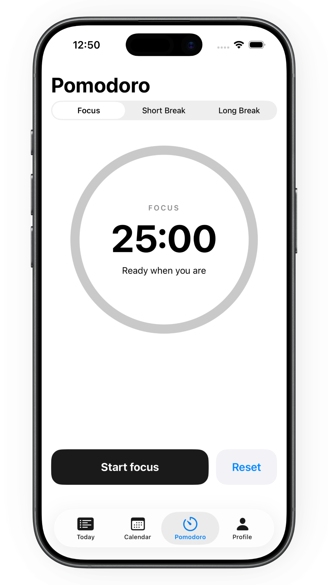
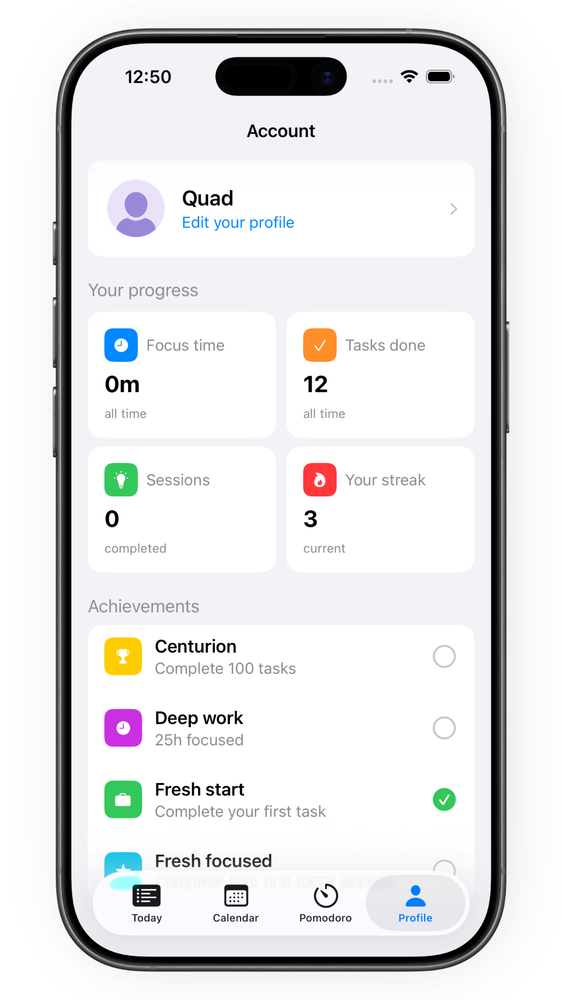

  

## About
**Flocus** is a lightweight iOS app for tracking tasks and building habits - without the clutter.

## Screenshots

<table>
  <tr>
    <td></td>
    <td></td>
    <td></td>
    <td></td>
    <td></td>
  </tr>
</table>

## Features

Flocus keeps it simple: plan your day, stay focused, and build a streak.

- **Onboarding** - 4-step setup: welcome, app intro, name, avatar
- **Today** - tasks due today and overdue incomplete tasks, with a progress card and daily streak.
- **Calendar** - browse and manage tasks for any date.
- **Pomodoro** - classic 25/5/15-minute timer with auto phase switching and session tracking.
- **Streak** - consecutive day streak for completing tasks.
- **Profile** - stats overview (completed tasks, focus time, streak) and achievements.

## Tech Stack

`Swift` `SwiftUI` `SwiftData` `UserDefaults` `Swift Testing`

**MVVM** - each screen has a dedicated ViewModel managing state and business logic.  
**Repository pattern** - `TaskRepository` and `StatsRepository` abstract data sources behind protocols.  
**Dependency injection** - repositories are injected via `setup()`, making ViewModels fully testable with mocks.

## Requirements
Xcode 26+  
Swift 6+

## License
MIT